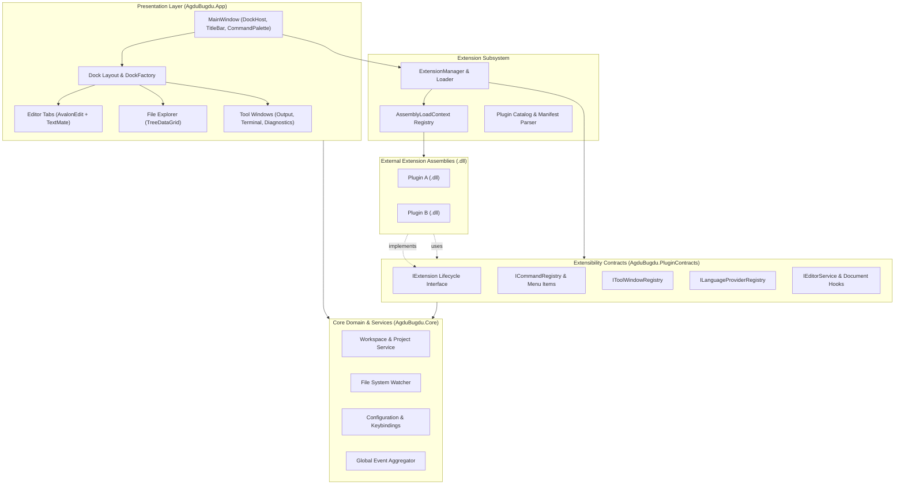
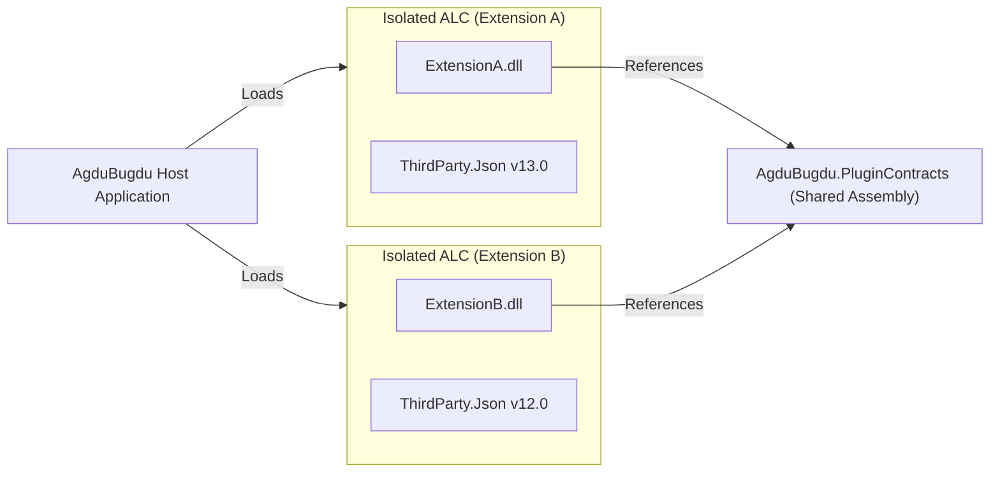

# AgduBugdu Editor

> A lightweight, cross-platform, modular code and text editor built with **Avalonia UI**, **AvalonEdit**, and a dynamic plugin architecture.

---

## 1. Project Brief

**AgduBugdu** is an extensible, cross-platform code and text editor designed for developers who want a responsive, native-feeling, and modular development environment. Built entirely within the modern .NET and Avalonia ecosystems, AgduBugdu combines hardware-accelerated rendering, an IDE-grade docking workspace, virtualized file browsing, and TextMate-powered syntax highlighting with an isolated extension system for third-party DLLs.

---

## 2. Core Goals & Scope

### 2.1 Core Pillars
- **Performance First**: Instant startup, minimal memory footprint, virtualized file trees, and rope-based text buffers that handle multi-megabyte files smoothly.
- **Cross-Platform**: First-class support for Windows, Linux, and macOS using Avalonia UI's unified rendering backends (DirectX, Vulkan, Metal, Skia).
- **Deep Extensibility**: A robust plugin ecosystem allowing external assemblies (`.dll`) to contribute commands, tool panels, editor decorators, syntax rules, and language support without recompiling the host application.
- **Modern Desktop UX**: Fluid docking, customizable split views, tabs, dark/light theme integration, and OS-native window chrome.

### 2.2 Scope & Capabilities

| Capability | In Scope (MVP & Near-Term) | Future Roadmap |
| :--- | :--- | :--- |
| **Workspace & Docking** | Dockable tool windows, document tabs, splitters, saved layouts | Multi-window detachment, remote workspaces |
| **Editing** | AvalonEdit buffer, line numbers, folding, bracket matching, caret multi-selection | Inline diff editor, minimap |
| **Syntax Highlighting** | VS Code TextMate grammars & themes via `AvalonEdit.TextMate` | Semantic token highlighting |
| **File Management** | High-performance virtualized tree view (`TreeDataGrid`), lazy loading, file system watcher | Integrated Git staging/blame tree |
| **Extensions** | Dynamic discovery, `AssemblyLoadContext` loading, extension manager UI, endpoint registration | Extension marketplace, out-of-process RPC plugins |
| **Terminal** | Integrated shell via `Pty.Net` (PowerShell, Bash, Zsh) | Multiplexed terminal tabs, split terminals |
| **Language Features** | Basic completions and snippets | Language Server Protocol (LSP) client integration |

---

## 3. Proposed Technology Stack

AgduBugdu leverages best-of-breed libraries across the Avalonia and .NET ecosystems:

| Component | Library / Package | Role & Justification |
| :--- | :--- | :--- |
| **Target Runtime** | `.NET 8` / `.NET 10` | High-performance JIT/AOT capabilities, modern C# language features, cross-platform runtime. |
| **UI Framework** | `Avalonia` (v11.x+) | Cross-platform, hardware-accelerated UI framework with flexible styling and XAML/code-behind support. |
| **Window Chrome & Styles** | `FluentAvalonia` | WinUI 3 controls, Mica/Acrylic glass backdrops, custom seamless titlebar, and theme management. |
| **Docking System** | `Dock.Avalonia` + `Dock.Model.Mvvm` | VS Code/Visual Studio-grade docking, floating tool windows, tabbed document groups, layout serialization. |
| **Editor Core** | `Avalonia.AvalonEdit` | High-performance `Rope<T>` text buffer, virtualized text rendering, folding, margin decorations. |
| **Syntax & Theming** | `AvalonEdit.TextMate` | Direct support for VS Code `.tmLanguage` grammars and JSON themes across 100+ languages. |
| **File Explorer** | `Avalonia.Controls.TreeDataGrid` | Virtualized hierarchical grid capable of rendering 100,000+ files and folders with near-zero latency. |
| **Iconography** | `FluentIcons.Avalonia` | Scalable vector glyphs for explorer nodes, actions, status indicators, and tabs. |
| **MVVM & Reactivity** | `CommunityToolkit.Mvvm` + `System.Reactive` | Source-generated viewmodels (`[ObservableProperty]`, `[RelayCommand]`), Rx event debouncing for watchers and search. |
| **Terminal Host** | `Pty.Net` | Spawns pseudo-terminals for native shells with bidirectional ANSI/VT100 streams. |
| **Dependency Injection** | `Microsoft.Extensions.DependencyInjection` | Industry-standard inversion of control container for services and plugin resolution. |

---

## 4. Proposed System Architecture

AgduBugdu is designed around decoupled layers: an agnostic Core Domain, a dedicated Extensibility Contract, Infrastructure implementations, an Extension Host, and the Presentation Shell.



---

## 5. Extension Manager & Plugin Architecture

AgduBugdu features a dedicated plugin infrastructure that allows external developers to write standard C# class libraries (`.dll`) to expand the editor's capabilities.

### 5.1 Architecture & Isolation (`AssemblyLoadContext`)
Extensions are loaded into isolated `AssemblyLoadContext` (ALC) instances:
- **Dependency Isolation**: Extensions can depend on different package versions without conflicting with the host application or each other.
- **Safe Unloading**: Using collectible `AssemblyLoadContext` instances, extensions can be reloaded or disabled at runtime without restarting the editor.
- **Shared Contracts**: The host exports `AgduBugdu.PluginContracts.dll`, which is marked as shared so types across the boundary map to identical runtime types.



### 5.2 Extension Manifest (`extension.json`)
Each extension is distributed as a directory containing an `extension.json` descriptor and its binary assets:

```json
{
  "id": "com.agdubugdu.git-integration",
  "name": "Git Status Badges",
  "version": "1.0.0",
  "entryPoint": "AgduBugdu.GitPlugin.dll",
  "mainClass": "AgduBugdu.GitPlugin.GitExtension",
  "author": "Community",
  "description": "Displays git branch and uncommitted markers in file explorer.",
  "dependencies": []
}
```

### 5.3 Exposed Extension Endpoints & Interfaces

The `AgduBugdu.PluginContracts` project defines points of integration:

```csharp
// 1. Entry point for third-party extensions
public interface IExtension
{
    string Id { get; }
    string Name { get; }
    void Initialize(IExtensionContext context);
    Task ActivateAsync();
    Task DeactivateAsync();
}

// 2. Extension context provided by the ExtensionManager
public interface IExtensionContext
{
    ICommandRegistry Commands { get; }
    IToolWindowRegistry ToolWindows { get; }
    IEditorService EditorService { get; }
    IWorkspaceService WorkspaceService { get; }
    IStatusBarService StatusBar { get; }
    ILogger Logger { get; }
}

// 3. Command registration endpoint
public interface ICommandRegistry
{
    void RegisterCommand(string commandId, string title, Func<Task> execute, KeyGesture? defaultShortcut = null);
    void RegisterMenuItem(string menuPath, string commandId, int order = 0);
}

// 4. Custom tool panels (dockable tools)
public interface IToolWindowRegistry
{
    void RegisterToolWindow<TViewModel, TView>(string toolId, string title, DockPosition defaultPosition)
        where TViewModel : class
        where TView : Control;
}

// 5. Editor hooks and document interceptors
public interface IEditorService
{
    event EventHandler<IDocumentOpenedEventArgs> DocumentOpened;
    event EventHandler<IDocumentSavedEventArgs> DocumentSaved;
    void RegisterTextDecorator(ITextDecorator decorator);
}
```

### 5.4 Extension Lifecycle
1. **Discovery**: `ExtensionManager` scans configured directories (e.g., `%APPDATA%/AgduBugdu/extensions/` and local `./extensions/`).
2. **Validation**: Reads `extension.json`, validates API version compatibility and required dependencies.
3. **Load**: Instantiates an isolated `PluginAssemblyLoadContext` and resolves referenced assemblies.
4. **Initialization**: Instantiates the entry type implementing `IExtension` and invokes `Initialize(context)`.
5. **Activation**: Calls `ActivateAsync()`; the extension binds its commands, tool windows, and event handlers.
6. **Teardown**: On application exit or plugin disable, calls `DeactivateAsync()`, unhooks registered endpoints, and releases the ALC for garbage collection.

---

## 6. Solution Project Layout

```
AgduBugdu/
├── src/
│   ├── AgduBugdu.PluginContracts/      # Public contracts & interfaces for plugins
│   │   ├── IExtension.cs
│   │   ├── IExtensionContext.cs
│   │   ├── ICommandRegistry.cs
│   │   ├── IToolWindowRegistry.cs
│   │   └── IEditorService.cs
│   │
│   ├── AgduBugdu.Core/                 # Core domain logic
│   │   ├── Models/                     # FileNode, TextBufferInfo, WorkspaceConfig
│   │   ├── Services/                   # WorkspaceService, FileService
│   │   └── Events/                     # EventAggregator and domain events
│   │
│   ├── AgduBugdu.Infrastructure/       # System I/O and process hosting
│   │   ├── FileSystem/                 # TreeDataGrid adapters, FileWatcher
│   │   ├── Terminal/                   # Pty.Net pseudo-terminal host
│   │   └── Lsp/                        # LSP client communication
│   │
│   ├── AgduBugdu.Extensibility/        # Extension manager engine
│   │   ├── PluginAssemblyLoadContext.cs
│   │   ├── ExtensionManager.cs
│   │   ├── ExtensionCatalog.cs
│   │   └── Registries/                 # Concrete implementations of contracts
│   │
│   └── AgduBugdu.App/                  # Avalonia desktop application
│       ├── Views/                      # MainWindow, EditorView, ExplorerView
│       ├── ViewModels/                 # MainViewModel, DocumentViewModel
│       ├── Dock/                       # CustomDockFactory, Dock templates
│       ├── Editor/                     # AvalonEdit configuration & TextMate setup
│       ├── App.axaml                   # FluentAvalonia theme resources
│       └── Program.cs                  # Bootstrapper & DI setup
│
├── extensions/                         # Built-in or sample extensions
│   └── AgduBugdu.SamplePlugin/         # Example plugin demonstrating endpoints
│
└── tests/
    └── AgduBugdu.Tests/                # Unit and integration test suite
```

---

## 7. Roadmap & Milestones

- [ ] **Milestone 1: Project Scaffolding & Core Shell**
  - Solution creation targeting `.NET 8` / `.NET 10`.
  - Avalonia 11 + FluentAvalonia setup with custom window chrome and theme switcher.
  - Basic MVVM configuration with Microsoft Dependency Injection.
- [ ] **Milestone 2: Docking & Text Editing**
  - Integrate `Dock.Avalonia` with document tabs and tool panels.
  - Integrate `Avalonia.AvalonEdit` with `AvalonEdit.TextMate` for syntax highlighting.
  - Basic file open, edit, save, and dirty-state tracking.
- [ ] **Milestone 3: File Explorer & Workspace System**
  - Implement high-performance `TreeDataGrid` file tree with lazy loading.
  - Live file watcher integration to refresh changes in real time.
- [ ] **Milestone 4: Extensibility Infrastructure**
  - Implement `AgduBugdu.PluginContracts` and `AgduBugdu.Extensibility`.
  - Create isolated `AssemblyLoadContext` loader with lifecycle management.
  - Build sample plugin demonstrating custom menu items and dockable tool panels.
- [ ] **Milestone 5: Terminal & Polishing**
  - Embedded pseudo-terminal panel via `Pty.Net`.
  - Command palette (`Ctrl+Shift+P` / `Cmd+Shift+P`) and quick file open (`Ctrl+P` / `Cmd+P`).
