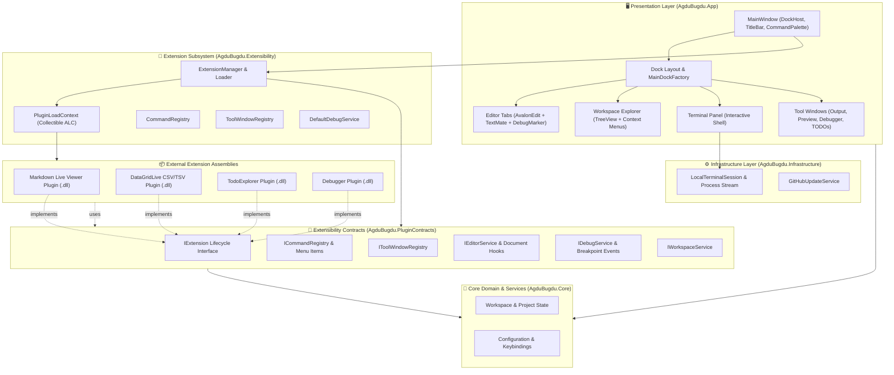
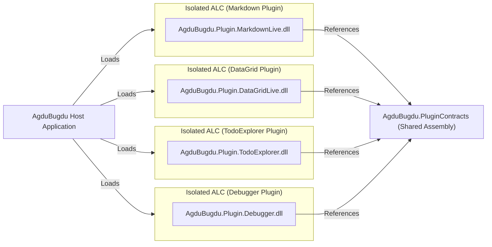

# 🚀 AgduBugdu Editor

> A lightweight, cross-platform, modular code and text editor built with **Avalonia UI**, **AvalonEdit**, and a dynamic plugin architecture. ✨

---

## 1. 📖 Project Brief

**AgduBugdu** is an extensible, cross-platform code and text editor designed for developers who want a responsive, native-feeling, and modular development environment. Built entirely within the modern .NET and Avalonia ecosystems, AgduBugdu combines hardware-accelerated rendering, an IDE-grade docking workspace, virtualized file browsing, and TextMate-powered syntax highlighting with an isolated extension system for third-party DLLs. ⚡

---

## 2. 🎯 Core Goals & Scope

### 2.1 🏛️ Core Pillars
- **⚡ Performance First**: Instant startup, minimal memory footprint, virtualized file trees, and rope-based text buffers that handle multi-megabyte files smoothly.
- **🌐 Cross-Platform**: First-class support for Windows, Linux, and macOS using Avalonia UI's unified rendering backends (DirectX, Vulkan, Metal, Skia).
- **🧩 Deep Extensibility**: A robust plugin ecosystem allowing external assemblies (`.dll`) to contribute commands, tool panels, editor decorators, syntax rules, and language support without recompiling the host application.
- **🎨 Modern Desktop UX**: Fluid docking, customizable split views, tabs, dark/light theme integration, and OS-native window chrome.

### 2.2 🔭 Scope & Capabilities

| 💎 Capability | ✅ In Scope (Current & Implemented) | 🔮 Future Roadmap |
| :--- | :--- | :--- |
| **🪟 Workspace & Docking** | Dockable tool windows, document tabs, splitters, layout serialization (`Dock.Avalonia`) | Multi-window detachment, remote workspaces |
| **📝 Editing** | AvalonEdit buffer, line numbers, word wrap, caret tracking, Ctrl+Wheel zoom, context menu | Inline diff editor, minimap |
| **🎨 Syntax Highlighting** | VS Code TextMate grammars & themes via `AvaloniaEdit.TextMate` | Semantic token highlighting |
| **📁 File Management** | Workspace Explorer with lazy subdirectory expansion, file double-click opening, Open Folder dialog | Live file system watcher, Git staging badges |
| **🔌 Extensions** | Collectible `PluginLoadContext` (ALC), runtime command palette contribution, tool windows | Extension marketplace, out-of-process RPC plugins |
| **⚡ Command Palette** | Modal command search (`Ctrl+P` / `Ctrl+Shift+P`) with hotkeys and dynamic execution | Fuzzy file navigation, symbol picker |
| **💻 Integrated Terminal** | Embedded interactive terminal session (PowerShell/Bash) synchronized with active workspace (`Ctrl+\``) | Multiplexed terminal tabs, split terminals |
| **🐞 Run & Debugger Workbench** | Breakpoint management (`F9`), active execution highlight, step controls (`F5`, `F10`, `F11`), call stack, variable watches, debug console | DAP (Debug Adapter Protocol) integration |
| **📋 Workspace TODO Explorer** | Automated recursive scanning for `TODO`, `FIXME`, `BUG`, `HACK`, `NOTE` with jump-to-source navigation | Custom regex tagging, export to Markdown |
| **📊 CSV / TSV Data Table Viewer** | Auto-delimiter detection, tabular viewer with search/filtering, accessible via file context menu | Inline table cell editing, data charts |
| **🎭 Themes** | Lonely Dark (neon violet) & Solarized Contrast (rich cyan) dynamic themes | Custom user theme JSON loader |
| **🔄 Auto-Updater** | Built-in GitHub Releases checker with interactive update modal | In-place silent background updater |

---

## 3. 🛠️ Technology Stack

AgduBugdu leverages best-of-breed libraries across the Avalonia and .NET ecosystems:

| 📦 Component | 📚 Library / Package | 🏷️ Version | 💡 Role & Justification |
| :--- | :--- | :--- | :--- |
| **🎯 Target Runtime** | `.NET 8` (`net8.0`) | `8.0` | High-performance JIT/AOT capabilities, modern C# language features, cross-platform runtime. |
| **🖥️ UI Framework** | `Avalonia` & `Avalonia.Desktop` | `11.3.2` | Cross-platform, hardware-accelerated UI framework with flexible styling and XAML/code-behind support. |
| **✨ Window Chrome & Styles** | `FluentAvaloniaUI` | `2.1.0` | WinUI 3 controls, dark/light theme management, and fluent styling. |
| **📐 Docking System** | `Dock.Avalonia` + `Dock.Model.Mvvm` | `11.3.2` | Professional docking, floating tool windows, tabbed document groups, layout serialization. |
| **📜 Editor Core** | `Avalonia.AvalonEdit` | `11.1.0` | High-performance `Rope<T>` text buffer, virtualized text rendering, caret tracking. |
| **🌈 Syntax & Theming** | `AvaloniaEdit.TextMate` | `11.1.0` | Direct support for VS Code `.tmLanguage` grammars and JSON themes across 100+ languages. |
| **🌲 Tree Data Grid** | `Avalonia.Controls.TreeDataGrid` | `11.1.1` | MIT-licensed virtualized hierarchical grid for file trees without commercial locks. |
| **🎨 Iconography** | `FluentIcons.Avalonia` | `1.1.225` | Scalable vector glyphs for explorer nodes, actions, status indicators, and tabs. |
| **⚡ MVVM & Reactivity** | `CommunityToolkit.Mvvm` | `8.4.0` | Source-generated viewmodels (`[ObservableProperty]`, `[RelayCommand]`). |
| **🔌 Extensibility Host** | Isolated `AssemblyLoadContext` | Native | Clean memory management and collectible assembly unloading. |
| **💻 Terminal Host** | Process standard I/O streaming & pseudoterminal abstraction | Native / Cross-platform | Interactive shell execution synchronized with workspace changes. |
| **💉 Dependency Injection** | `Microsoft.Extensions.DependencyInjection` | `8.0.1` | Inversion of control container for services and plugin resolution. |

---

## 4. 🏗️ System Architecture

AgduBugdu is designed around decoupled layers: an agnostic Core Domain, a dedicated Extensibility Contract, Infrastructure implementations, an Extension Host, and the Presentation Shell.



---

## 5. 🔌 Extension Manager & Plugin Architecture

AgduBugdu features a dedicated plugin infrastructure that allows external developers to write standard C# class libraries (`.dll`) to expand the editor's capabilities.

### 5.1 🛡️ Architecture & Isolation (`AssemblyLoadContext`)
Extensions are loaded into isolated `AssemblyLoadContext` (ALC) instances:
- **🔒 Dependency Isolation**: Extensions can depend on different package versions without conflicting with the host application or each other.
- **♻️ Safe Unloading**: Using collectible `AssemblyLoadContext` instances, extensions can be reloaded or disabled at runtime without restarting the editor.
- **🤝 Shared Contracts**: The host exports `AgduBugdu.PluginContracts.dll`, which is marked as shared so types across the boundary map to identical runtime types.



### 5.2 📋 Exposed Extension Endpoints & Interfaces

The `AgduBugdu.PluginContracts` project defines points of integration:

```csharp
// 1. Entry point for third-party extensions
public interface IExtension
{
    string Id { get; }
    string Name { get; }
    string Version { get; }
    void Initialize(IExtensionContext context);
    Task ActivateAsync();
    Task DeactivateAsync();
}

// 2. Extension context provided by the ExtensionManager
public interface IExtensionContext
{
    ICommandRegistry Commands { get; }
    IToolWindowRegistry ToolWindows { get; }
    IEditorService EditorService { get; }
    IWorkspaceService WorkspaceService { get; }
    IDebugService DebugService { get; }
    void Log(string message, string level = "Info");
}

// 3. Command registration endpoint
public interface ICommandRegistry
{
    void RegisterCommand(string id, string title, Func<Task> execute, string? shortcut = null);
    void RegisterMenuItem(string menuPath, string commandId, int order = 0);
    IReadOnlyDictionary<string, CommandDescriptor> GetRegisteredCommands();
}

// 4. Custom tool panels (dockable tools)
public interface IToolWindowRegistry
{
    void RegisterToolWindow(string id, string title, Func<object> viewModelFactory, Func<object, object> viewFactory);
    IReadOnlyDictionary<string, ToolWindowDescriptor> GetRegisteredTools();
}

// 5. Editor hooks and document navigation
public interface IEditorService
{
    event EventHandler<DocumentEventArgs>? DocumentOpened;
    event EventHandler<DocumentEventArgs>? DocumentSaved;
    event EventHandler<DocumentEventArgs>? DocumentClosed;
    event EventHandler<NavigationEventArgs>? LineNavigationRequested;
    string? ActiveDocumentPath { get; }
    void OpenFile(string filePath);
    void OpenFile(string filePath, int line, int column = 1);
}

// 6. Debugging, breakpoints & execution engine
public interface IDebugService
{
    DebugState State { get; }
    IReadOnlyList<BreakpointInfo> Breakpoints { get; }
    event EventHandler<BreakpointEventArgs>? BreakpointAdded;
    event EventHandler<BreakpointEventArgs>? BreakpointRemoved;
    event EventHandler<DebugStateChangedEventArgs>? StateChanged;
    event EventHandler<string>? OutputReceived;
    void ToggleBreakpoint(string filePath, int line);
    Task StartDebuggingAsync();
    Task StopDebuggingAsync();
    Task StepOverAsync();
    Task StepIntoAsync();
    Task ContinueAsync();
}
```

### 5.3 📦 Built-In Extensions

AgduBugdu comes bundled with standard productivity plugins:

1. **AgduBugdu.Plugin.MarkdownLive**: Live HTML preview for Markdown files, updating as you type. Context menu "View Markdown Live" appears exclusively for `.md` documents.
2. **AgduBugdu.Plugin.DataGridLive**: RFC 4180 compliant CSV/TSV table viewer with automatic delimiter detection (comma, tab, semicolon, pipe) and real-time text filtering. Context menu "Open as Data Table" appears for `.csv` and `.tsv` files.
3. **AgduBugdu.Plugin.TodoExplorer**: Workspace task explorer that recursively scans for `TODO`, `FIXME`, `BUG`, `HACK`, and `NOTE` tags across your project, complete with color badges and double-click navigation straight to the code line.
4. **AgduBugdu.Plugin.Debugger**: Interactive Run & Debugger tool pane with full breakpoint toggle support (`F9`), active execution line tracking (yellow highlight), step controls (`F5`, `F10`, `F11`), call stack viewer, variable watches, and debug console output.

---

## 6. 📁 Solution Project Layout

```
AgduBugdu/
├── .github/
│   └── workflows/
│       └── release.yml                  # 🚀 Multi-platform CI/CD release workflow
├── src/
│   ├── AgduBugdu.PluginContracts/       # 📜 Public contracts & interfaces for plugins
│   │   ├── IExtension.cs
│   │   ├── IExtensionContext.cs
│   │   ├── ICommandRegistry.cs
│   │   ├── IToolWindowRegistry.cs
│   │   ├── IEditorService.cs
│   │   ├── IDebugService.cs
│   │   └── IWorkspaceService.cs
│   │
│   ├── AgduBugdu.Core/                  # 🧠 Core domain logic & global versioning
│   │   ├── AppVersionInfo.cs
│   │   └── Updates/                     # Update service interfaces & models
│   │
│   ├── AgduBugdu.Infrastructure/        # ⚙️ System I/O, process hosting & GitHub updates
│   │   ├── Terminal/                    # LocalTerminalSession & process streaming
│   │   └── Updates/                     # GitHubUpdateService implementation
│   │
│   ├── AgduBugdu.Extensibility/         # 🧩 Extension manager engine
│   │   ├── PluginLoadContext.cs         # Collectible AssemblyLoadContext
│   │   ├── ExtensionManager.cs          # Assembly scanner, loader, and unloader
│   │   ├── ExtensionContext.cs          # Concrete implementation of IExtensionContext
│   │   ├── Services/                    # DefaultDebugService & default implementations
│   │   └── Registries/                  # Thread-safe Command & Tool registries
│   │
│   └── AgduBugdu.App/                   # 🖥️ Avalonia desktop application
│       ├── Assets/                      # Custom app icons (PNG, ICO)
│       ├── Docking/                     # MainDockFactory (Dock.Avalonia layout wiring)
│       ├── Models/                      # FileSystemItem (lazy loading hierarchical model)
│       ├── Themes/                      # ThemeManager (Lonely Dark & Solarized Contrast)
│       ├── ViewModels/                  # MainViewModel, CommandPaletteViewModel, Documents, Tools
│       ├── Views/                       # MainWindow, CommandPalette, UpdateModal, Editor, Explorer, Terminal, Debugger, TODOs
│       ├── App.axaml                    # Theme configuration (FluentAvalonia, Dock, TreeDataGrid)
│       └── Program.cs                   # Desktop application bootstrapper
│
├── plugins/
│   ├── AgduBugdu.Plugin.MarkdownLive/   # 📝 Live Markdown Preview plugin
│   ├── AgduBugdu.Plugin.DataGridLive/   # 📊 CSV / TSV Data Table Viewer plugin
│   ├── AgduBugdu.Plugin.TodoExplorer/   # 📋 Workspace TODO & Task Explorer plugin
│   └── AgduBugdu.Plugin.Debugger/       # 🐞 Run & Debugger Workbench plugin
│
├── tests/
│   └── AgduBugdu.Tests/                 # 🧪 Fast xUnit test suite (lifecycle, registries, terminal, documents, plugins)
│       ├── ExtensionManagerTests.cs
│       └── PluginTests.cs
│
├── tools/
│   ├── run.ps1                          # 🪟 Windows PowerShell local build, test, and GUI runner
│   ├── run.sh                           # 🐧 Bash / Cygwin / POSIX local build, test, and GUI runner
│   ├── ci-build.ps1                     # 🤖 Dedicated runner for GitHub Actions CI/CD workflows
│   ├── installer.iss                    # 📦 Inno Setup script for Windows Setup EXE
│   └── convert-icon.ps1                 # 🎨 Icon generation utility
│
├── CHANGELOG.md                         # 📋 Semantic versioning release log
└── Directory.Build.props                # 🏷️ Solution-wide centralized global version
```

---

## 7. 🚀 Build, Dependency Check & Run

Use the provided runner scripts in `tools/` to check prerequisites, restore missing dependencies, build, and run:

### 🪟 Windows (PowerShell)
```powershell
# 1. Check dependencies and build local solution
.\tools\run.ps1

# 2. Check dependencies, build, and run the test suite
.\tools\run.ps1 -RunTests

# 3. Build and launch the AgduBugdu editor desktop app
.\tools\run.ps1 -LaunchApp

# 4. Verbose logging / diagnose issues
.\tools\run.ps1 -VerboseLogging
```

### 🐧 Cygwin / MSYS2 / POSIX Bash
```bash
# 1. Check dependencies and build local solution
./tools/run.sh

# 2. Check dependencies, build, and run the test suite
./tools/run.sh -t

# 3. Build and launch the AgduBugdu editor desktop app
./tools/run.sh -l

# 4. Force clean restore & verbose logging
./tools/run.sh -f -v
```

---

## 8. 🗺️ Implementation Roadmap & Milestones

- [x] **🏁 Milestone 1: Project Scaffolding & Core Shell**
  - Modular solution setup (`slnx`) targeting `.NET 8`.
  - Pinned stable LTS Avalonia `11.3.2` + `FluentAvaloniaUI` `2.1.0`.
  - Automated dependency validator and runner scripts.
- [x] **🪟 Milestone 2: Docking Architecture & IDE Shell**
  - Integrated `Dock.Avalonia` with left tool panel, center document dock, and bottom output pane.
  - Interactive Command Palette overlay (`Ctrl+P` / `Ctrl+Shift+P`) with real-time filtering.
  - Modern bottom status bar tracking cursor position, encoding, and workspace state.
- [x] **✏️ Milestone 3: Core Editor Experience (AvalonEdit)**
  - `AvaloniaEdit.TextMate` integration with `DarkPlus` theme and automatic language grammar detection.
  - Native file I/O: Open (`Ctrl+O`), Save (`Ctrl+S`), Save As (`Ctrl+Shift+S`), and New File (`Ctrl+N`).
  - Dirty buffer tracking (`*` indicator) and duplicate tab prevention.
  - Editor enhancements: Current line highlight, smart indentation, context menu (Cut/Copy/Paste/Select All), and `Ctrl+MouseWheel` font zoom.
- [x] **📁 Milestone 4: Workspace File Explorer**
  - Hierarchical workspace explorer with lazy-loading directory expansion.
  - Native folder selection via Avalonia `StorageProvider.OpenFolderPickerAsync` (`Ctrl+K, Ctrl+O`).
  - Double-click file opening into dock tabs.
- [x] **🔌 Milestone 5: Extensibility Subsystem & Markdown Live Plugin**
  - Collectible `PluginLoadContext` with shared contracts isolation.
  - Dynamic command registration and synchronization into host Command Palette.
  - End-to-end sample plugin: `AgduBugdu.Plugin.MarkdownLive` live-updating HTML output from markdown documents.
- [x] **💻 Milestone 6: Integrated Terminal & Workspace Synchronization**
  - Cross-platform process shell hosting (`LocalTerminalSession`) in `AgduBugdu.Infrastructure``.
  - Interactive terminal dock tool panel (`TerminalToolView` + `TerminalToolViewModel`) with input line and clear screen.
  - Dynamic workspace synchronization: automatically re-targets working directory to newly opened workspace folders (`Ctrl+OemTilde`).
  - Terminal commands exposed in menu bar, hotkeys, and Command Palette.
- [x] **🎨 Milestone 7: Themes, Branding, Auto-Updater & Multi-Platform Release**
  - Dual built-in themes: **Lonely Dark** (neon violet) and **Solarized Contrast** (rich cyan/petrol teal).
  - Custom AI-generated futuristic monogram app icon & logo branding.
  - Global solution versioning via `Directory.Build.props` and `AppVersionInfo`.
  - GitHub Releases auto-updater modal with release highlights.
  - GitHub Actions multi-platform workflow (`win-x64` setup exe & portable zip, `linux-x64`, `osx-x64`, `osx-arm64`).
- [x] **🐞 Milestone 8: Built-in Extensions & Debugger Ecosystem**
  - **DataGridLive**: RFC 4180 CSV / TSV data table viewer with search and delimiter auto-detection.
  - **TodoExplorer**: Recursive workspace TODO scanner with file/line navigation.
  - **Debugger Workbench**: Breakpoint toggling (`F9`), active execution line highlighting, debug actions (`F5`, `F10`, `F11`, `Shift+F5`), Call Stack, Variables Watch, and Debug Console dock window.
